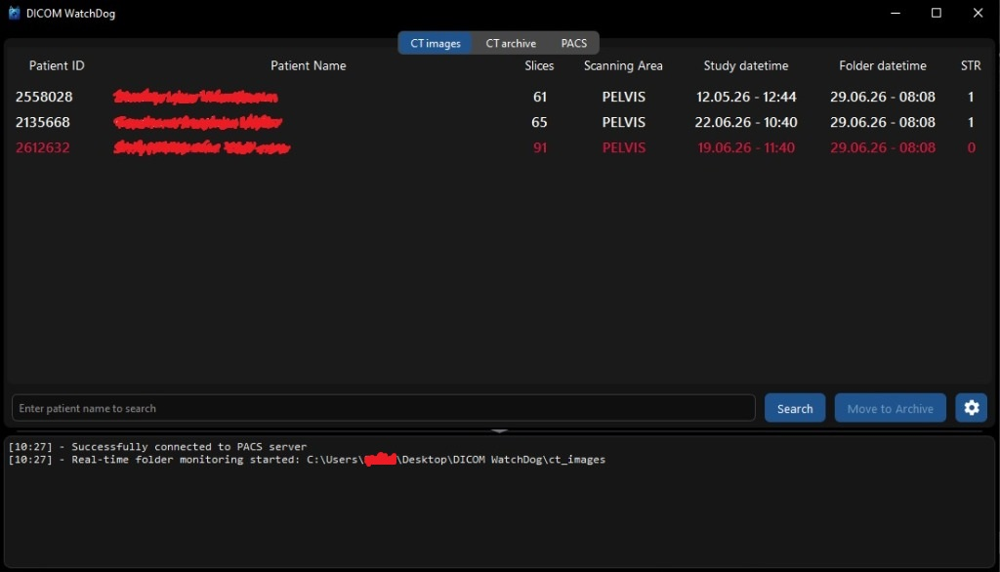

# DICOM WatchDog

[English](#english) | [Русский](#русский)

<details open>
  <summary>📷 View Screenshot / Посмотреть скриншот</summary>

  
</details>

---

## English

DICOM WatchDog is a lightweight desktop utility designed for automated monitoring, organization, and backup of DICOM studies (CT images) from scanning workstations and local archives, with optional integration with PACS servers.

### Executable (EXE) Editions
When downloading release assets, choose the executable that best fits your environment:
- **`DICOM WatchDog.exe`** (Main Edition — Recommended for Windows 10/11)
  - Built on Python 3.11 with PyQt6.
  - Recommended for modern computers. Includes native bootloader splash screen for instant visual feedback on startup.
- **`DICOM WatchDog Legacy.exe`** (Compatibility Edition — Windows 7 / 8.1 / 10 Legacy)
  - Built on Python 3.8 with PyQt5.
  - Tailored specifically for legacy OS workstations (e.g. Windows 7 SP1) or machines with legacy graphics drivers. Native splash screen is disabled to avoid startup DWM/API crashes and guarantee 100% compatibility.

### Key Features
- **Real-Time Monitoring**: Automatically scans folders for new CT scan files.
- **Smart Metadata Fixing**: Corrects invalid Patient IDs (removing dots, prefixes) inside DICOM tags.
- **Dynamic Renaming**: Renames study folders using customizable patterns: `Patient ID`, `Patient Name`, `Patient Name [Patient ID]`, or `[Patient ID] Patient Name`.
- **Auto-Archiving**: Archives old patient studies after a defined period and cleans up obsolete structures.
- **PACS Integration**: Search and download patient studies directly from PACS servers.

### Quick Start
1. Install dependencies: `pip install -r requirements.txt`
2. Run the application: `python main.py`
3. Configure folder paths and PACS connection in settings.

### Building from Source (EXE)
To compile the application into a standalone executable:
- **Main Edition (`DICOM WatchDog.exe`)**: Compile using Python 3.11+.
  ```bash
  python build_PyQt6.py
  ```
- **Legacy Edition (`DICOM WatchDog Legacy.exe`)**: You **must use Python 3.8** for compilation. Newer Python versions (3.9+) are not compatible with Windows 7.
  ```bash
  python build_PyQt5_Legacy.py
  ```

### License
This project is licensed under the [GNU General Public License v3.0 (GPLv3)](LICENSE).

### ⚠️ Medical Disclaimer
This software is provided for research, data management, and workflow automation purposes only. It is **NOT** a certified medical device (CE-marked or FDA-cleared) and **MUST NOT** be used as a primary diagnostic tool or treatment planning software without independent clinical verification.

---

## Русский

DICOM WatchDog — это легковесная утилита для автоматического мониторинга, сортировки и резервного копирования КТ-исследований (DICOM) с рабочих станций сканирования и локальных архивов с возможностью работы с PACS-серверами.

### Официальные редакции EXE-файлов
При скачивании релизов выберите файл, подходящий для вашего рабочего окружения:
- **`DICOM WatchDog.exe`** (Основная редакция — Рекомендуется для Windows 10/11)
  - Собрано на Python 3.11 и PyQt6, предназначено для современных рабочих станций. Включает нативный анимированный экран загрузки.
- **`DICOM WatchDog Legacy.exe`** (Совместимая редакция — Windows 7 / 8.1 / 10)
  - Собрано на Python 3.8 и PyQt5, специальная стабильная версия для устаревших рабочих станций (например, Windows 7 SP1) или компьютеров с устаревшими видеокартами.

### Ключевые возможности
- **Мониторинг в реальном времени**: Автоматическое сканирование папок на наличие новых КТ-снимков.
- **Исправление метаданных**: Автоматическая коррекция неверных Patient ID (удаление точек, префиксов) в тегах DICOM.
- **Гибкое переименование папок**: Переименование папок пациентов по шаблонам: `Patient ID`, `Patient Name`, `Patient Name [Patient ID]`, или `[Patient ID] Patient Name`.
- **Автоархивирование**: Автоматическое перемещение старых исследований в архив по истечении заданных дней и очистка лишних структур.
- **PACS интеграция**: Быстрый поиск и скачивание исследований напрямую с PACS-серверов.

### Быстрый старт
1. Установите зависимости: `pip install -r requirements.txt`
2. Запустите приложение: `python main.py`
3. Настройте пути к папкам и PACS-подключение в меню настроек.

### Сборка исполняемых файлов (EXE)
Для компиляции приложения в автономный EXE-файл:
- **Основная редакция (`DICOM WatchDog.exe`)**: Выполните сборку с помощью Python 3.11+.
  ```bash
  python build_PyQt6.py
  ```
- **Совместимая редакция (`DICOM WatchDog Legacy.exe`)**: Сборку **необходимо выполнять строго на Python 3.8**. Более новые версии Python (3.9+) несовместимы с Windows 7.
  ```bash
  python build_PyQt5_Legacy.py
  ```

### Лицензия
Этот проект распространяется под лицензией [GNU General Public License v3.0 (GPLv3)](LICENSE).

### ⚠️ Медицинский дисклеймер
Данное программное обеспечение предназначено исключительно для исследовательских целей, автоматизации рабочих процессов и управления данными. Оно **НЕ является** зарегистрированным медицинским изделием (CE / РУ Росздравнадзора / FDA) и **НЕ ДОЛЖНО** использоваться в качестве основного инструмента для диагностики или планирования лечения без независимой клинической проверки.
